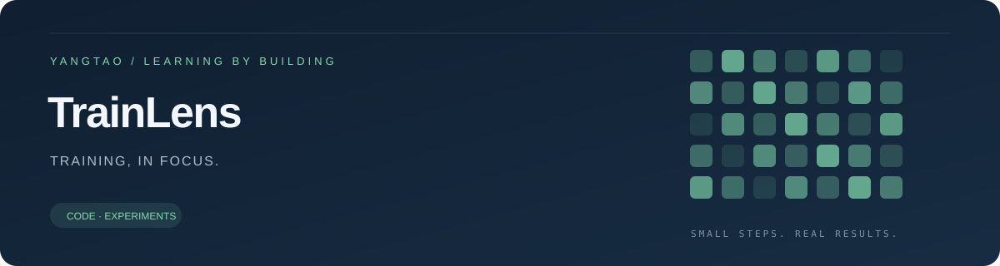
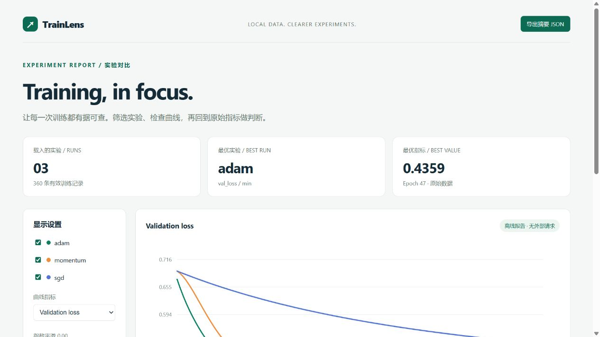

<p align="center"></p>

<p align="center">
  <a href="https://github.com/Yangtao666China/training-log-visualizer/actions/workflows/tests.yml"></a>
  
  
  <a href="LICENSE"></a>
</p>

<h1 align="center">训练日志可视化：CSV 转离线报告</h1>
<p align="center">Turn training logs into a self-contained, interactive HTML report.</p>

选择几份训练日志，生成一份离线可用的报告：对比曲线、切换指标、显示平滑曲线、检查最优轮次，再导出原始指标摘要。核心只使用 Python 标准库，报告不依赖 CDN、账号或服务器。



## 一条命令生成报告

Python 3.10+，在仓库根目录直接运行，无需安装依赖：

```bash
python -m trainlens "sample_runs/*.csv" --output artifacts/report.html
```

双击生成的 `artifacts/report.html` 即可打开。仓库已提供 [完整示例报告](artifacts/report.html) 和 [摘要 JSON](artifacts/report.json)。GitHub 文件预览不会执行 HTML，需下载到本地后用浏览器打开。

如果需要在其他目录调用，可以安装：

```bash
python -m pip install -e .
trainlens "my_runs/*.csv" --output results/comparison.html
```

## 报告里有什么？

- 勾选显示哪些实验，切换 train / validation loss 或 accuracy。
- 指数平滑滑杆；只影响曲线，最优值和表格始终使用原始数据。
- 最优轮次、最终验证损失和该最优轮次的 train/validation 损失差。
- 依据最优指标或实验名排序表格。
- 下载 JSON 摘要；HTML 自带全部数据，无外部网络请求。
- 拒绝 NaN/Inf、重复或乱序 epoch、缺失字段和无效准确率，给出文件名与行号。

## 日志格式

```csv
epoch,train_loss,val_loss,train_acc,val_acc
1,0.693,0.701,0.51,0.49
2,0.621,0.648,0.67,0.62
3,0.552,0.589,0.73,0.69
```

| 字段 | 要求 |
|---|---|
| `epoch` | 必需，非负整数且严格递增；允许从 0 或 1 开始、允许间隔 |
| `train_loss`, `val_loss` | 必需，有限数值 |
| `train_acc`, `val_acc` | 可选；一旦提供整列，每行都应填写 `[0, 1]` 数值 |
| 其他列 | 忽略，可保留学习率等原始日志字段 |

一份文件代表一次实验，文件名（去除 `.csv`）用作实验名，所以不同目录下的同名 CSV 需要先改名。支持 UTF-8 和 UTF-8 BOM。每份日志至少一行数据。

## 指定选择标准

默认取最小 `val_loss`，相同最佳值取首次出现的轮次：

```bash
python -m trainlens "sample_runs/*.csv" --metric val_acc --mode max --output artifacts/accuracy.html
python -m trainlens run_a.csv run_b.csv --title "Learning rate sweep" --output artifacts/lr.html
```

**选择准确率时记得传 `--mode max`。** 顶部最优实验与表格都使用命令行指定的选择标准；左侧指标选择器只改变曲线。

## 示例数据是真的训练日志

仓库中的三个 CSV 由 [generate_runs.py](examples/generate_runs.py) 实际运行 NumPy 逻辑回归得到：固定种子 42、600 个训练样本和 200 个验证样本、相同零初始化，分别使用 SGD、Momentum 和 Adam，120 轮。

```bash
python -m pip install -e ".[example]"
python examples/generate_runs.py
python -m trainlens "sample_runs/*.csv" --output artifacts/report.html
python -m unittest discover -s tests -v
```

三种优化器都使用示例学习率 0.03，但相同学习率不代表相同的有效步长或公平调参。数据用于演示报告功能，不是优化器排名结论。没有使用独立测试集，因此报告不声称泛化评测结果。

## 与其他项目一起用

[Tiny Autograd Lab](https://github.com/Yangtao666China/autograd-from-scratch) 的 `history.csv` 使用兼容格式。复制多个实验的日志并分别命名，就可以比较学习率、网络大小或随机种子。

## 设计与限制

参见 [设计说明](docs/design.md)。12 项测试覆盖日志校验、最优轮次选择、HTML 转义、JSON 嵌入和命令行行为。

报告将所有数据嵌入一个 HTML 文件，适合几组到几十组中小型实验；长日志会增大文件体积。曲线悬停点最多约 90 个/实验，线条仍包含所有记录。它不做统计显著性检验，也不能凭单个损失差认定过拟合。

本项目由 AI 辅助编写，报告示例及生成方法均可复现。MIT License。
